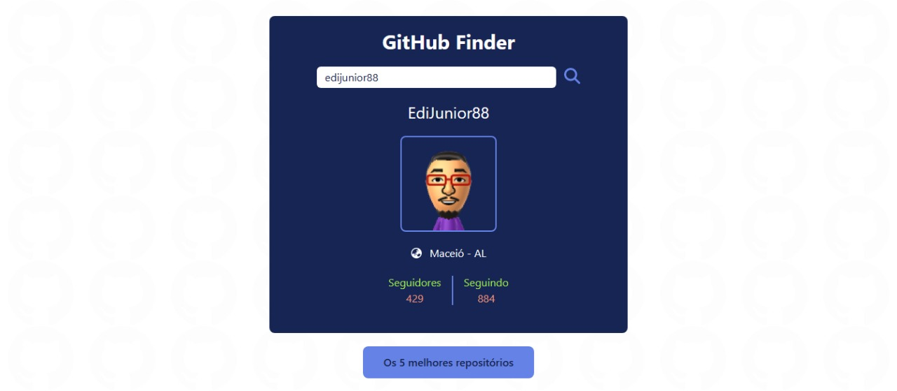
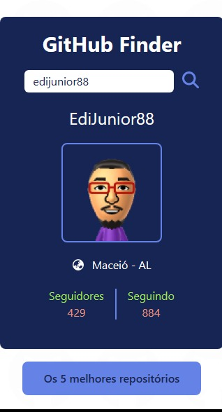

<h3>GitHub Finder</h3>

Um projeto que utiliza a API do GitHub para buscar um usuário e mostrar os 5 melhores repositórios com mais estrelas

<strong>Link do projeto:</strong> <a href="https://githubfinder-edijunior88.netlify.app/" target="_blank" >https://githubfinder-edijunior88.netlify.app/</a>

<h3><strong>Modo Desktop</strong></h3>

 

<h3><strong>Modo Mobile</strong></h3>

<h3><strong>Tecnologias Utilizadas</strong></h3>

<table>
  <tr>
    <td>
      
    </td>
    <td>
      
    </td>
    <td>
      
    </td>
     <td>
      
    </td>
    <td>
      
    </td>
  </tr>

  <tr>
    <td>
      
    </td>
    <td>
      
    </td>
     <td>
      
    </td>
     <td>
      
    </td>
     <td>
      
    </td>
  </tr>

  <tr>
    <td>
      
    </td>   
  </tr>
</table>

<h3><strong>Ferramentas Utilizadas</strong></h3>

<table>
  <tr>
    <td>
      
    </td>
    <td>
      
    </td>
    <td>
      
    </td>
  </tr>
</table>

<h3>Tempo Estudando o projeto</h3>

  

<h4><b>Status do projeto:</b> ✅ Concluído</h4>
